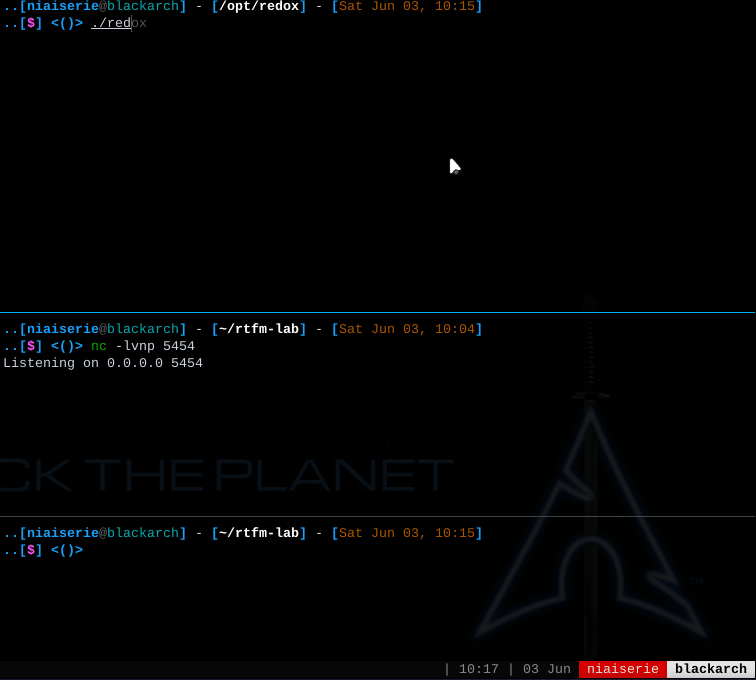

The goal of this project is to create an easier to use and updated replacement for [RTFM](https://github.com/leostat/rtfm) (inspired by the book, Red Team Field Manual) as well as something that works similarly to [Rev Shells](https://revshells.com/) or the [HackTools](https://addons.mozilla.org/en-US/firefox/addon/hacktools/) browser plugin.  All without the need to leave your terminal to search through notes or open a browser window, or run a python script with a lot of switches you'll never remember.  

I'm currently using the sqlite database that [RTFM](https://github.com/leostat/rtfm) uses but that hasn't been updated in almost 6 years so I will be adding new commands and pushing the edited db file to the repository as I use this tool myself.    

## Working Features
- **note** Sometimes on Kali the backspace/delete key requires Ctrl+Backspace/Delete to delete previous typed characters in terminal.  And in some cases Ctrl+h stops working so I've added a 'hist' command for when that occurs until I figure out some of the intermittent key stroke issues.  
- Ctrl+r to dynamically search the RTFM database for commands as you type and display those in a selectable list.  Works similarly to using Ctrl+r to search through terminal history.
- Ctrl+h to display a history of previously selected commands from the current session in a selectable list. 
- up/down arrow keys to highlight a command from the current search or from the history. Pressing return copies that command to the clipboard.  
- 'info' displays full information on the currently selected command along with any variables that can be set and that are already set.  
- 'add -c [command]' to add a new command to the database.  optional: -d to add a comment/description with the command.
- 'update [column] [content]' to update a database column in the currently selected command.  At the moment the only columns to update are 'command', 'comment' and 'author'. Examples: "update comment spawn a pty via python3", "update author greg scharf", "update command python3 -c 'import pty;pty.spawn("/bin/bash")'".  
- 'set' to set variables that will be replaced in commands that have placeholders such as [LHOST], [RHOST], etc. Example: 'set LHOST 10.200.13.3'



## To Add
- [x] Set variables in the CLI to automatically replace placeholders in commands for things like Remote Host, Local Host, Local Port, etc similar to msfconsole.  
- [ ] After adding a new command select it as the current command.
- [ ] Add config file to store user set variables and other as yet to be determined configurations.
    - This might be the place for related commands that are often used together. Add ability to save the commands in the current history.  Would need a way to quickly delete a command in the current history e.g. highlight the command and then Ctrl+d to remove it. Also need to be able to completely clear the current history.  User would also need to supply a name for the history before it is saved to the config file.  These would be stored as an array of row IDs from TblCommand. Use the 'config' crate to facilitate this.  
- [x] Add 'env' command to display all user set variables.
- [ ] 'Ctrl+u' url encode the currently selected command and copy to the clipboard
- [ ] Ctrl+d while in selectable list deletes the item from the database, or if in history mode, deletes the item from the current history.
- [ ] Left/right arrow keys to edit already typed or pasted in command.  Really only useful when adding to or updating the database.
- [ ] Make use of tags already implemented in the database to display selectable list of grouped items. For example, 'reverse shells linux' to display all commands in the database grouped under that tag.  tags already in the database are probably a little too general to be useful e.g. 'bash', 'windows'.  Also need a function to display all tags in the database as a selectable list.
- [x] Add ability to update the database columns of the currently selected command.
- [x] Display command's comment and any other info after it has been selected.
- [x] Add a history feature, ctrl+h or type 'history' to show a selectable list of previously copied commands.
- [x] Show currently selected command in prompt, type info to show all columns to allow for easier updating of the database within the CLI.
- [ ] Implement [RTFM](https://github.com/leostat/rtfm)'s solution for creating/updating the database
- [ ] Continue to updating database with newer commands for things like Bloodhound,ffuf,feroxbuster,Rubeus,Crackmapexec,Chisel,SSHuttle, etc.
- [ ] Add a better method for generating help content with the prettytable crate.
- [x] Allow selection mode to wrap up or down
- [ ] Switch from termion to crossterm for Windows support.
- [ ] Add search capability for text based/markdown notes.    
    - Root directory for user's notes will be supplied in a CLI variable.
- [ ] Use pre-existing 'refs' table to link to markdown notes and display notes in terminal when selected... there is probably a crate to display markdown.

## To Fix
- [ ] Add buffer to scroll through result output that doesn't fit within terminal windows.
- [x] Handle error when output exceeds terminal window so application doesn't crash on Arch.
    - Needs a much better solution
- [ ] Sometimes backspace/delete key requires Ctrl+Backspace/Delete to delete typed character preceding cursor.
- [ ] Switch from termion to crossterm to add support for Windows consoles.      
- [ ] Switch to rusqlite and dump sqlx to avoid openssl static build nightmare so I can create a release build.

## To Use
```bash
#if you don't already have rust installed
curl --proto '=https' --tlsv1.2 -sSf https://sh.rustup.rs | sh

git clone https://github.com/gregscharf/RTFM-Redox.git
cd RTFM-Redox
cargo run --release
```

**Issues**
Debian distributions: If the linker fails during build, install the following packages.
```bash
sudo apt install libxcb1-dev libxcb-render0-dev libxcb-shape0-dev libxcb-xfixes0-dev
```
Arch: No issues

Mac M1: Screen flicker when using up/down arrows 

Windows: Currently not supported because Termion does not work on windows.  I'll switch to crossterm at some point.